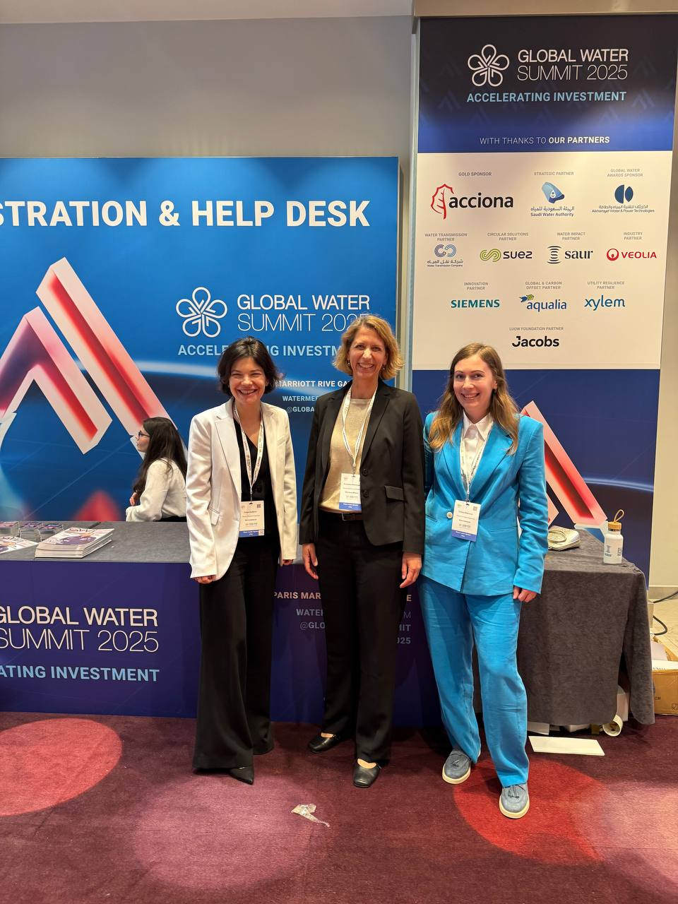

# Water Summit – Paris 2025

This repository contains materials from the **Global Water Summit 2025** held in Paris.  
It includes event **presentation slides** and **photo documentation** of participation, networking, and exhibition.

---

## Summit Materials

- [`Sammit_Paris1.pdf`](Sammit_Paris1.pdf) – Official PDF presentation  
- Photos from the summit (May 2025):
  - `photo_2025-05-14_21-26-02.jpg`
  - `photo_2025-05-19_10-35-37.jpg`
  - `photo_2025-05-19_18-16-39.jpg`
  - `photo_2025-05-19_18-33-29.jpg`
  - `photo_2025-05-19_18-51-43.jpg`

---

## About the Event

The Global Water Summit is a leading annual event focused on innovation, infrastructure, and digital transformation in water utilities.  
Our participation included:

- Presentation on **AI-based adaptive control of water networks**
- Live demo of **GNN + PINN models**
- Networking with EU Horizon coordinators and infrastructure stakeholders

---

## Credits

Repository curated by [Tania Starovoyt](https://github.com/Tania526-sudo)  
Part of the research collaboration on **Hybrid AI for Resilient Infrastructure**

---

## Preview

